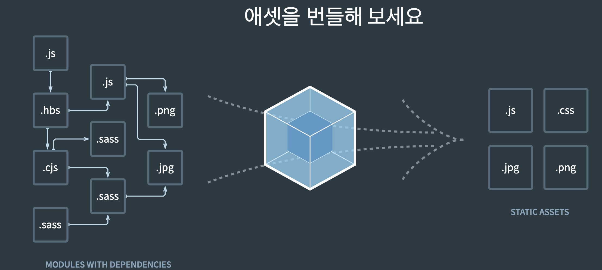

# webpack 시작

## webpack

- 모듈로 연결된 다양한 파일을 하나로 합쳐주는 역할
- 그림의 좌측에 포함된 다양한 파일 -> webpack(번들러) -> 우측의 결과 파일(번들)

## webpack 설치
- `npm install -D webpack webpack-cli`
- "-D" 명령: 개발자 환경으로 설정한다.
- node_modules/.bin/webpack 을 실행하여 webpack 작업 실행

## webpack 실행
- `node_modules/.bin/webpack --mode development --entry ./src/app.js --output dist/main.js`
- "--mode": development? production? none? 으로 설정해서 개발용, 배포용, 그 외로 정의
- "--entry": 시작점(entry point) 설정
- "--output" 결과물 위치(output) 설정
- 위 명령어를 통해 개발용으로, src/app.js를 시작점으로, /dist/main.js 라는 파일을 생성하여 결과를 저장
- index.html에 로딩하듯이
```
    <script src="/dist/main.js"></script>
```
- 위와 같이 로딩하면 전처럼 실행 가능

